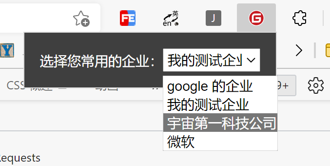
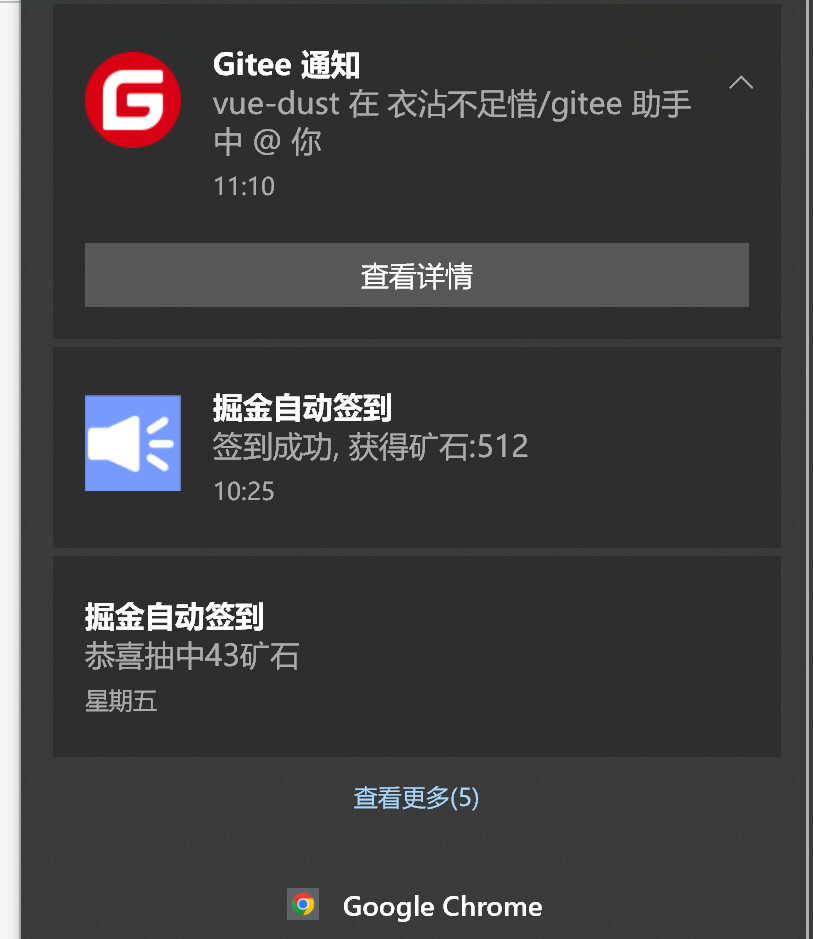
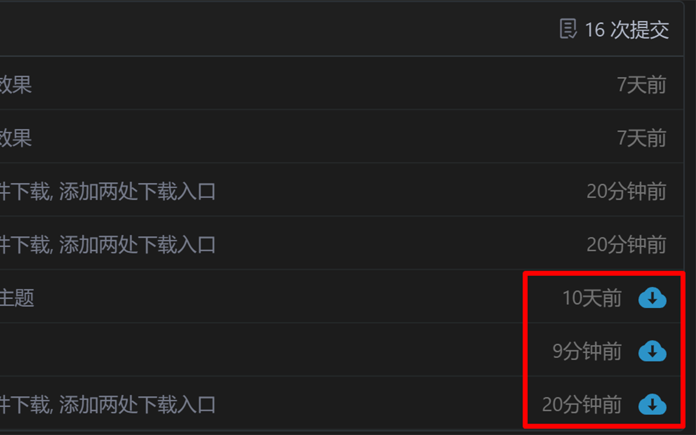
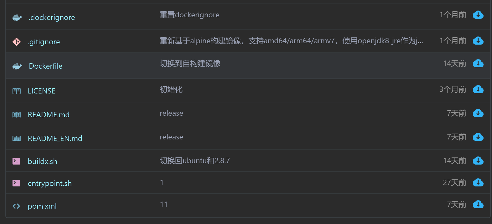
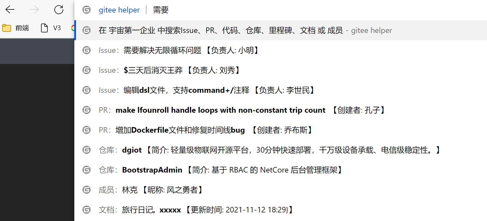

## gitee 小助手

### 功能特性
- 暗黑主题
- 桌面消息通知, 一键抵达目标
- 下载仓库单文件
- 易于识别的文件图标
- 搜索栏指令 (通过地址栏快速搜索企业内容)
- 无需提供账号密码 token 等信息
### 使用方法
1. 下载发行版解压出文件夹 `https://gitee.com/stringify/gitee-helper/releases`
2. 浏览器打开开发者模式
3. 点击 '加载已解压缩的扩展', 选择dist文件夹,
4. 选择自己的常用企业：
 
5. 完成
### 暗黑主题
  - 全部页面主题替换为暗黑主题 (企业版除外)
  - 图片不会被影响
  6LNFXJ1GN%5D47VF4E.jpg)
  如需取消主题, 请注释 `manifest.json`文件中的`"css":["css/dark.css"], `
### 桌面消息通知
 - 所有消息通知至桌面
 - 点击查看详情会跳转到对应页面, 并标记已读
 - 工作时间外不会通知
 - 通知频率为 45s/次
 - 相同通知未被清除, 不会再重复通知


### 下载仓库单个文件
- 仓库目录树右侧添加下载单文件按钮
- 文件详情页面顶部添加下载按钮

### 文件图标
左侧增加 446 种高对比度文件图标。（鼠标移至图标上会显示文件类型名称）


### 搜索栏指令
 触发方式：地址栏输入 `gitee` 按下 tab键 (或按空格)
不输入指令时, 会同时搜索 issue PR 仓库 和成员。
|指令|示例|效果|指令匹配的正则|
|---|---|---|--------|
|空指令 |`任意内容`|聚合搜索 issue、PR、仓库、成员|无|
|Issue: |`issue: bug`|搜索 issue|`/^(Issue\|任务):/i`|
|PR: |`pr: name`|搜索 PR|`/^(PR\|pull request):/`|
|repo: |`仓库: 仓库名称`|搜索仓库|`/^(Repo\|Project\|仓库):/i`|
|doc: |`doc: xxx说明`|搜索文档|`/^(doc\|文档\|知识库):/i`|
|Member: |`member: 刘`|搜索成员|`/^(Member\|成员\|用户):/i`|
|New Issue|`new issue`|新建 issue|`/^(New Issue\|新建任务):/i`|
|New PR|`new pr`|新建 PR, 查看差异|`/^(New PR\|新建评审):/i`|
|New Project|`new project`|新建仓库|`/^(New Project\|New Repo\|新建仓库):/i`|




### 开发 && 手动构建

安装依赖
```bash
yarn install
```
构建
```bash
yarn run build
```
开发
```bash
yarn run watch
```
#### todo
 - [x] 改为 webpack 构建
 - [x] 优化指令效果
 - [x] 直接显示搜索结果列表
 - [x] 自定义配置常用企业名称
 - [ ] 在浏览器扩展图标添加未阅读消息数
 - [ ] 暗黑主题可配置 (目前不可配置, insertCss() 生效慢)
 - [x] 仓库文件添加易于识别的图标