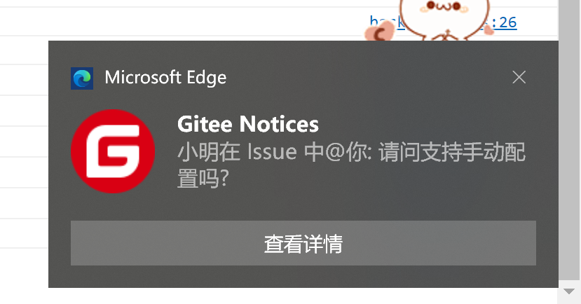
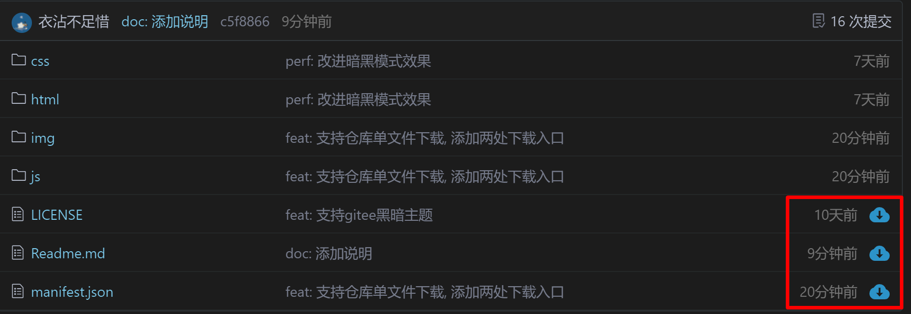

## gitee 小助手
### 使用方法
1. `git clone git@gitee.com:stringify/gitee-helper.git`
2. 浏览器打开开发者模式
3. 点击 '加载已解压缩的扩展', 选择本仓库文件夹
4. 完成
### 功能特性
- 暗黑主题
- 桌面消息通知, 一键抵达目标
- 下载仓库单个文件
- 浏览器搜索栏指令
- 无需提供账号密码 token 等信息
### 暗黑主题
  - 全部页面主题替换为暗黑主题 (企业版除外)
  - 图片不会被影响
  6LNFXJ1GN%5D47VF4E.jpg)
  如果需要取消, 请注释 `manifest.json`文件中的`"css":["css/dark.css"], `
### 桌面消息通知
 - 所有消息通知至桌面
 - 点击查看详情会跳转到对应页面, 并标记已读
 - 工作时间外不会通知
 - 通知频率为 60s/次
 - 相同通知未被清除, 不会再重复通知


### 下载仓库单个文件
- 仓库目录树右侧添加下载单文件按钮
- 文件详情页面顶部添加下载按钮



### 搜索栏指令
触发方式: 地址栏输入 `gitee` 按下 tab键

|指令|效果|
|---|---|
|Issue: |搜索 issue|
|PR: |搜索 PR|
|Code: |搜索 代码|
|New Issue|新建 issue|
|New PR|新建 PR, 查看差异|
### 开发 && 手动构建

安装依赖
```bash
yarn install
```
构建
```bash
yarn run build
```
开发
```bash
yarn run watch
```
#### todo
 - [x] ~~### 改为 webpack 构建~~
 - [ ] 优化指令效果
 - [ ] 直接显示搜索结果列表
 - [ ] 自定义配置企业名称 或者常用仓库
 - [ ] 下载单目录
 - [ ] 在浏览器扩展图标添加未阅读消息数
 - [ ] 暗黑主题可配置 (目前不可配置, insertCss() 生效慢)